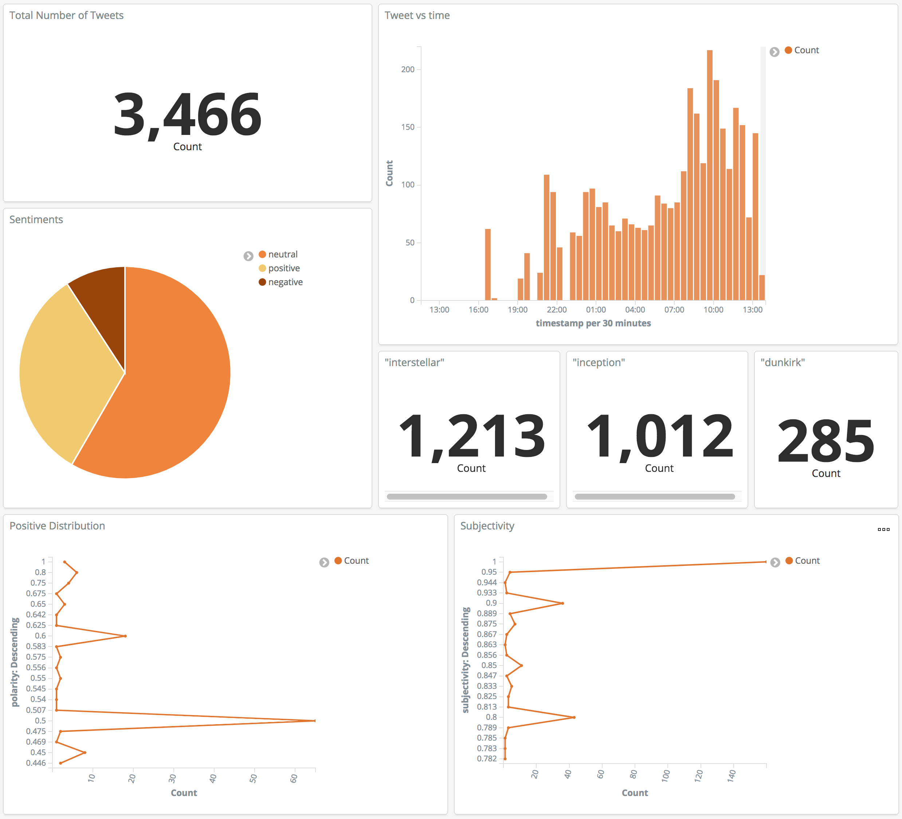
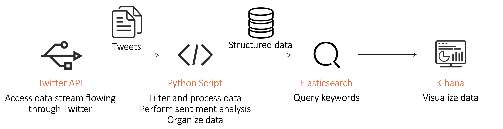
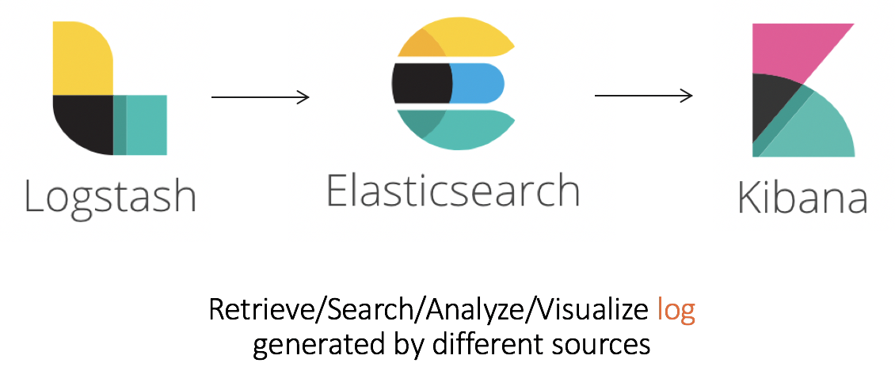
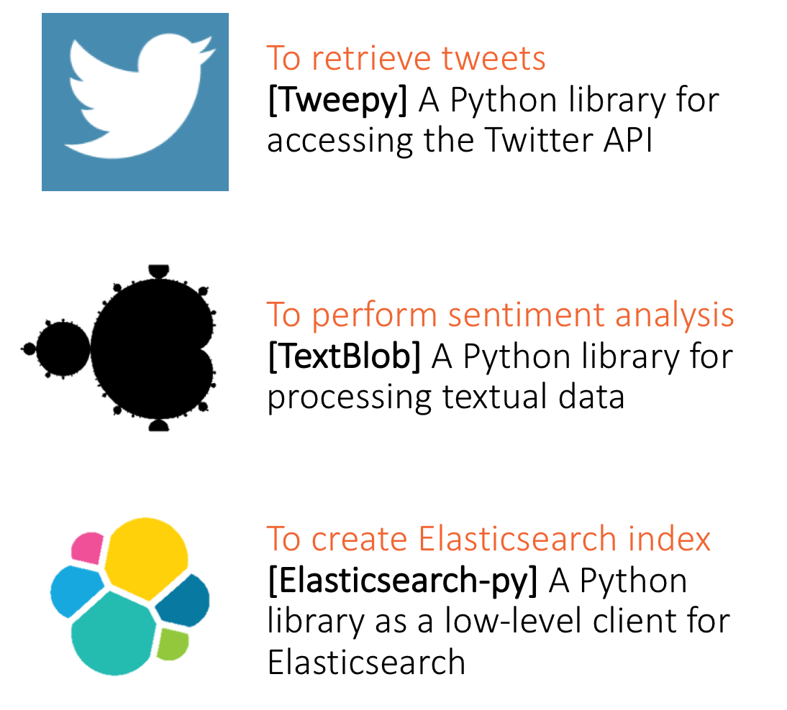

# Twitter Sentiment Analysis Using ELK Stack and Python




## Workflow


## Technical Background

### ELK Stack

<p align="center">
    </div>
</p>

### Python Integration

<p align="center">
    
</p>


## Prerequisites

### Install ELK Stack
Install and setup Elasticsearch and Kibana

### Twitter API

### Google Map API

## Usage
As the program starts running, you will see ouputs on your console like this:
```
==> Topics ['#interstellar', '#inception', '#dunkirk', 'interstellar', 'inception', 'dunkirk']
==> Start retrieving tweets...
=> Retrievd a tweet
[sentiment] positive
[hashtags] Dunkirk
[country] None
[time] 2018-09-29T21:04:01+00:00
=> Retrievd a tweet
[sentiment] neutral
[hashtags] None
[country] None
[time] 2018-09-29T21:04:18+00:00
...
```


