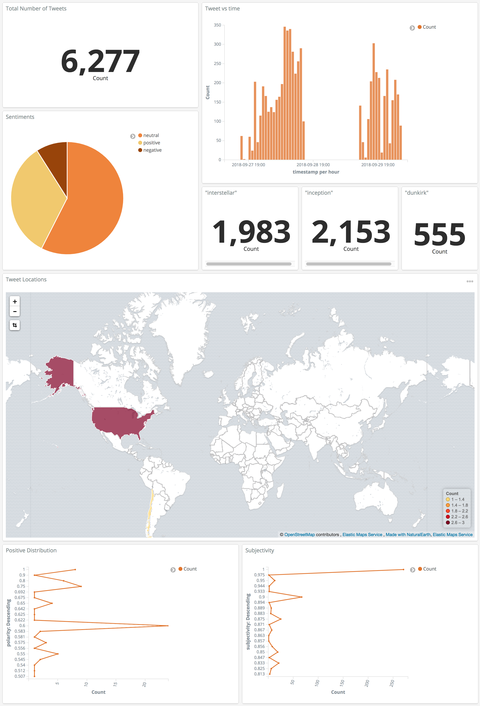
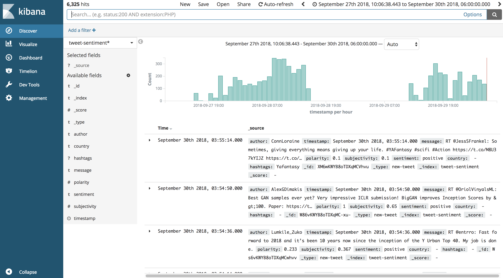

# Twitter Sentiment Analysis Using ELK Stack and Python




## Table of Contents
<!-- TOC -->

- [Twitter Sentiment Analysis Using ELK Stack and Python](#twitter-sentiment-analysis-using-elk-stack-and-python)
    - [Table of Contents](#table-of-contents)
    - [Workflow](#workflow)
    - [Technical Background](#technical-background)
        - [ELK Stack](#elk-stack)
        - [Python Integration](#python-integration)
    - [Prerequisites](#prerequisites)
        - [Install ELK Stack](#install-elk-stack)
        - [Twitter API](#twitter-api)
        - [Google Map API](#google-map-api)
    - [Usage](#usage)
        - [Configure credentials](#configure-credentials)
        - [Change the names of `index` and `doc_type`](#change-the-names-of-index-and-doc_type)
        - [Run the program with your topics of choice](#run-the-program-with-your-topics-of-choice)
    - [Sample Output](#sample-output)

<!-- /TOC -->


## Workflow
I created an image to better illustrate how the entire project works.


## Technical Background

### ELK Stack

<p align="center">
    </div>
</p>

### Python Integration

<p align="center">
    
</p>


## Prerequisites

### Install ELK Stack
Install and setup Elasticsearch and Kibana

### Twitter API

### Google Map API

## Usage
### Configure credentials
In `config.py`, type in your own API keys and tokens.
```python
consumer_key = "<Your_Twitter_Consumer_Key>"
consumer_secret = "<Your_Twitter_Consumer_Secret>"
access_token = "<Your_Twitter_Access_Token>"
access_token_secret = "<Your_Twitter_Access_Token_Secret>"

google_api_key = "<Your_Google_Map_API_Key>"
```

### Change the names of `index` and `doc_type`
If you are not happy with the default values of `index` and `doc_type`, you can change them at `main.py`, line 27-28.
```python
index = "tweet-sentiment"
doc_type = "new-tweet"
```

### Run the program with your topics of choice
Run the following command in your terminal
```
python3 main.py <any-topics-that-you-are-interested-in>
```
For example
```
python3 main.py coldplay muse suede 
```
You can also directly run
```
python3 main.py
```
It will filter tweets on the default topics `#interstellar, #inception, #dunkirk, interstellar, inception, dunkirk`.

## Sample Output
As the program starts running, you will see ouputs on your console similar to this (the `Topics`, `Index` and `doc type` values might vary depending on your configuration):
```
==> Topics ['#interstellar', '#inception', '#dunkirk', 'interstellar', 'inception', 'dunkirk']
==> Index: tweet-sentiment, doc type: new-tweet
==> Start retrieving tweets...
=> Retrievd a tweet
[sentiment] positive
[hashtags] Dunkirk
[country] None
[time] 2018-09-29T21:04:01+00:00
=> Retrievd a tweet
[sentiment] neutral
[hashtags] None
[country] None
[time] 2018-09-29T21:04:18+00:00
...
```
You can also check the streaming status by opening `Kibana` and clicking on the `Discover` tab.



